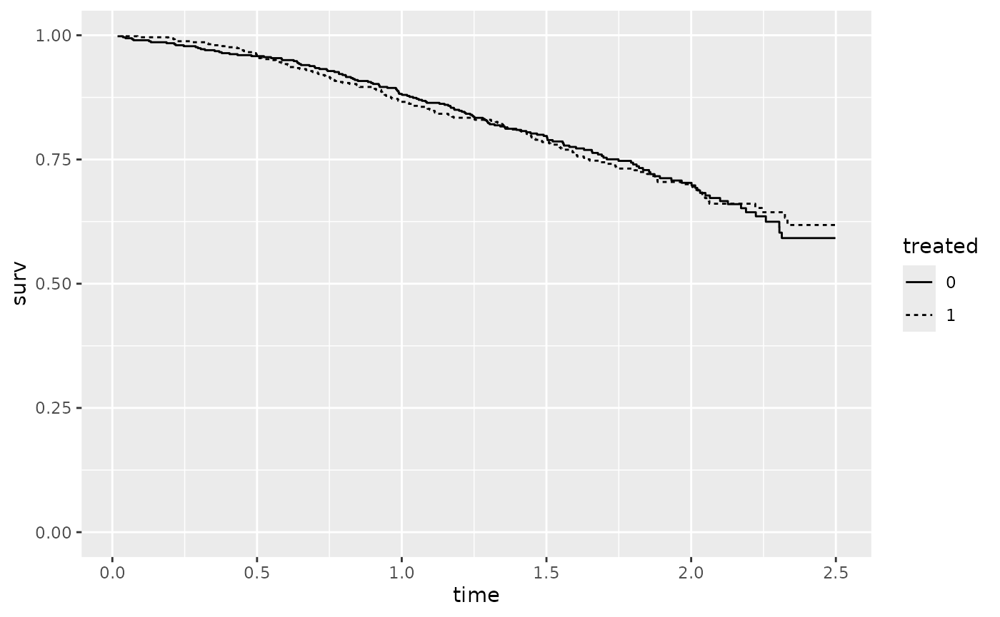

# Iterative Parameter Estimation

``` r

library(trtswitch)
library(dplyr, warn.conflicts = FALSE)
library(ggplot2)
library(survival)
```

## Introduction

The iterative parameter estimation (IPE) method is an alternative to the
rank preserving structural failure time model (RPSFTM) method to adjust
for treatment switching within a counterfactual framework. Both methods
assume a common treatment effect. However, instead of using g-estimation
to find the optimal value of \\\psi\\, the IPE method iteratively fits a
parametric survival model.

## Estimation of \\\psi\\

With an initial estimate of \\\psi\\ from the intention-to-treat (ITT)
analysis using an accelerated failure time (AFT) model to compare the
randomized treatment groups, the IPE method iterates between the
following two steps until convergence:

1.  Derive the counterfactual survival times and event indicators
    (possibly recensored) for patients in the control group, \\
    U\_{i,\psi} = T\_{C_i} + e^{\psi} T\_{E_i}, \\ \\ D\_{i,\psi}^\* =
    \min(C_i, e^{\psi} C_i), \\ \\ U\_{i,\psi}^\* = \min(U\_{i,\psi},
    D\_{i,\psi}^\*), \\ \\ \Delta\_{i,\psi}^\* = \Delta_i I(U\_{i,\psi}
    \leq D\_{i,\psi}^\*). \\

2.  Fit an AFT model to the adjusted data set consisting of

    - The observed survival times of the experimental group:
      \\\\(T_i,\Delta_i,Z_i): A_i = 1\\\\

    - The counterfactual survival times for the control group:
      \\\\(U\_{i,\psi}^\*, \Delta\_{i,\psi}^\*, Z_i): A_i = 0\\\\
      evaluated at \\\psi = \hat{\psi}\\.

The updated estimate of \\\psi\\ is equal to the negative of the
regression coefficient for the treatment indicator in the AFT model.

## Estimation of Hazard Ratio

This step is the same as the RPSFTM method. Once \\\psi\\ has been
estimated, we can fit a (potentially stratified) Cox proportional
hazards model to the adjusted data set. This allows us to obtain an
estimate of the hazard ratio. The confidence interval for the hazard
ratio can be derived by either

1.  Matching the p-value from the log-rank test for an ITT analysis, or
2.  Bootstrapping the entire adjustment and subsequent model-fitting
    process.

## Concorde Trial Example

We will demonstrate the use of the `ipe` function with simulated data
based on the randomized Concorde trial.

We start by preparing the data and then apply the IPE method:

``` r

data <- immdef %>% mutate(rx = 1-xoyrs/progyrs)

fit1 <- ipe(
  data, id = "id", time = "progyrs", event = "prog", treat = "imm", 
  rx = "rx", censor_time = "censyrs", aft_dist = "weibull",
  boot = FALSE)
```

The log-rank test for an ITT analysis, which ignores treatment changes,
yields a borderline significant p-value of \\0.056\\.

``` r

paste0("P-value", " (", fit1$pvalue_type, "): ", formatC(fit1$pvalue, format = "f", digits = 4))
#> [1] "P-value (log-rank): 0.0556"
```

Using the IPE method with a Weibull AFT model, we estimate \\\hat{\psi}
= -0.183\\, which is similar to the estimate obtained from the RPSFTM
analysis.

``` r

fit1$psi
#> [1] -0.182931
```

The Kaplan-Meier plot of counterfactual survival times supports the
estimated \\\hat{\psi}\\.

``` r

ggplot(fit1$kmstar, aes(x=time, y=surv, group=treated,
                        linetype=as.factor(treated))) + 
  geom_step() + 
  scale_linetype_discrete(name = "treated") + 
  scale_y_continuous(limits = c(0,1))
```



The estimated hazard ratio from the Cox proportional hazards model is
\\0.766\\, with a 95% confidence interval of \\(0.583, 1.006)\\, closely
aligning with the results from the RPSFTM analysis.

``` r

c(fit1$hr, fit1$hr_CI)
#> [1] 0.7657898 0.5826782 1.0064459
```

## Potential Convergence Issues

There is no guarantee that the IPE method will produce an unique
estimate of the causal parameter \\\psi\\. To see this, consider the
following SHIVA data for illustration purposes only.

``` r

shilong1 <- shilong %>%
  arrange(bras.f, id, tstop) %>%
  group_by(bras.f, id) %>%
  slice(n()) %>%
  select(-c("ps", "ttc", "tran"))

shilong2 <- shilong1 %>%
  mutate(rx = ifelse(co, ifelse(bras.f == "MTA", dco/ady, 
                                1 - dco/ady),
                     ifelse(bras.f == "MTA", 1, 0)),
         treated = 1*(bras.f == "MTA"))
```

Now let us apply the IPE method using the Brent’s method for root
finding:

``` r

fit2 <- ipe(
  shilong2, id = "id", time = "tstop", event = "event",
  treat = "bras.f", rx = "rx", censor_time = "dcut",
  base_cov = c("agerand", "sex.f", "tt_Lnum", "rmh_alea.c",
               "pathway.f"),
  aft_dist = "weibull", boot = FALSE)
```

The reported causal parameter estimate is \\\hat{\psi} = 0.953\\, while
the negative of the coefficient for the treatment variable in the
updated AFT model fit equals \\0.950\\:

``` r

fit2$fit_aft$parest[, c("param", "beta", "sebeta", "z")]
#>                    param         beta      sebeta          z
#> 1            (Intercept)  6.934726180 0.495626813 13.9918302
#> 2                treated -0.949765785 0.150227468 -6.3221846
#> 3                agerand -0.003290492 0.006498532 -0.5063439
#> 4            sex.fFemale  0.322266209 0.156016643  2.0655887
#> 5                tt_Lnum -0.014139569 0.028712690 -0.4924502
#> 6             rmh_alea.c -0.671748350 0.156970327 -4.2794607
#> 7            pathway.fHR -0.174054294 0.239966697 -0.7253269
#> 8 pathway.fPI3K.AKT.mTOR -0.149492619 0.241468215 -0.6190985
#> 9             Log(scale) -0.209508066 0.076278866 -2.7466070
```

This suggests that the \\\psi\\ value has not converged. The following
code demonstrates the oscillation of \\\psi\\ values between 0.955,
0.951, and 0.960 after additional iterations.

``` r


f <- function(psi) {
  data1 <- shilong2 %>%
    filter(treated == 0) %>%
    mutate(u_star = tstop*(1 - rx + rx*exp(psi)),
           c_star = pmin(dcut, dcut*exp(psi)),
           t_star = pmin(u_star, c_star),
           d_star = ifelse(c_star < u_star, 0, event)) %>%
    select(-c("u_star", "c_star")) %>%
    bind_rows(shilong2 %>%
                filter(treated == 1) %>%
                mutate(u_star = tstop*(rx + (1-rx)*exp(-psi)),
                       c_star = pmin(dcut, dcut*exp(-psi)),
                       t_star = pmin(u_star, c_star),
                       d_star = ifelse(c_star < u_star, 0, event)))
  
  fit_aft <- survreg(Surv(t_star, d_star) ~ treated + agerand + sex.f +  
                       tt_Lnum + rmh_alea.c + pathway.f, data = data1)  
  -fit_aft$coefficients[2]
}

B <- 30
psihats <- rep(0, B)
psihats[1] <- fit2$psi
for (i in 2:B) {
  psihats[i] <- f(psihats[i-1])
}

data2 <- data.frame(index = 1:B, psi = psihats)
tail(data2)
#>    index       psi
#> 25    25 0.9550293
#> 26    26 0.9511406
#> 27    27 0.9603835
#> 28    28 0.9550297
#> 29    29 0.9511409
#> 30    30 0.9603837
```

``` r

ggplot(data2, aes(x = index, y = psi)) + 
  geom_point() + 
  geom_line()
```


