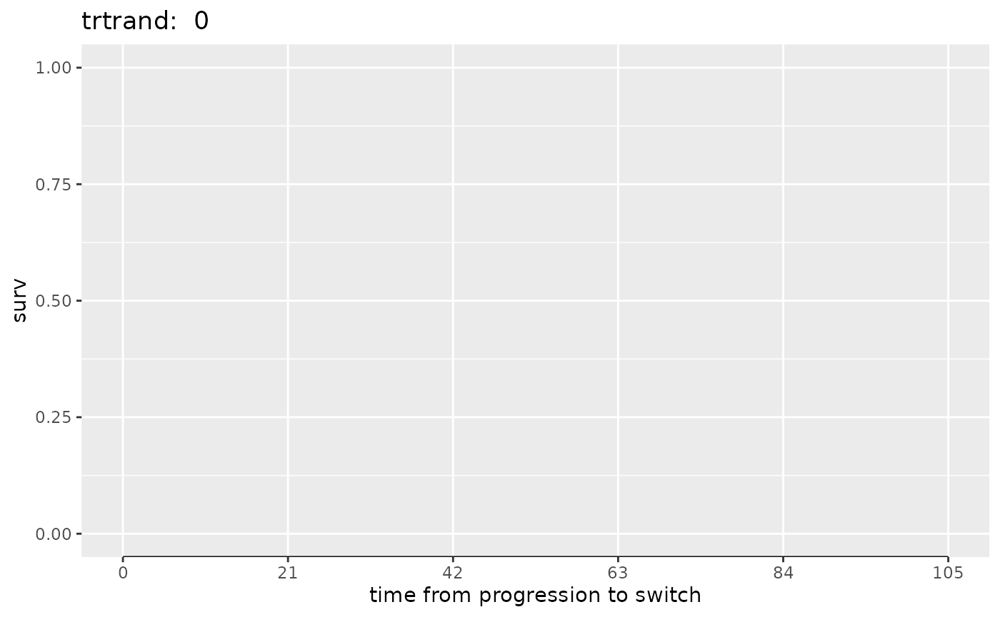

# Two-Stage Estimation With g-estimation

``` r

library(trtswitch)
library(dplyr, warn.conflicts = FALSE)
library(ggplot2)
```

## Introduction

TSEgest is an extension of the simple two-stage estimation (TSE) method
by incorporating a structural nested model (SNM) and utilizing
g-estimation. This allows a delay between disease progression (secondary
baseline) and treatment switch, provided that time-dependent confounding
variables that predict switching and survival are measured beyond the
secondary baseline and included in the model for treatment switching.
One key assumption for the TSEgest method is no unmeasured confounding,
i.e., switching is independent of potential outcomes conditional on
measured variables.

## Estimation of \\\psi\\

To derive the g-estimate of \\\psi\\, we utilize a logistic regression
model for switching \\ \textrm{logit}(p(E\_{ik})) = \alpha U\_{i,\psi} +
\sum\_{j} \beta_j x\_{ijk} \\ alongside a structural model for
counterfactual post progression survival times \\ U\_{i,\psi} =
T\_{C_i} + e^{\psi}T\_{E_i} \\ Here \\T\_{C_i}\\ refers to the time
spent after disease progression on control treatment, and \\T\_{E_i}\\
refers to the time spent after disease progression on the experimental
treatment.

### Key Components

- **Switch Indictor \\E\_{ik}\\**: This variable indicates whether
  subject \\i\\ switched treatment at observation \\k\\, starting from
  the secondary baseline up to and including the time of treatment
  switching. The secondary baseline visit corresponds to the first
  observation \\(k=1)\\ in the logistic regression model.

  - If a patient switches treatment two visits after disease
    progression, they contribute three records to the switching model:
    \\E\_{i1} = 0\\, \\E\_{i2} = 0\\, and \\E\_{i3} = 1\\.

  - If a patient does not switch treatment and either dies or is
    censored four visits after disease progression, they contribute five
    records, with \\E\_{ik} = 0\\ for \\k=1,\ldots,5\\.

- **Confounders \\x\_{ijk}\\**: These are the confounding variables
  measured for subject \\i\\ at observation \\k\\. Visit-specific
  intercepts can be modeled using a natural cubic spline with specified
  degrees of freedom, denoted as \\\nu\\ (corresponding to the `ns_df`
  parameter of the `tsegest` function). The boundary and internal knots
  can be based on the range and percentiles of observed treatment
  switching times, respectively. Here, \\\nu\\ equals the number of
  internal knots plus one; a value of \\\nu=0\\ indicates a common
  intercept, while \\\nu=1\\ leads to a linear effect of visit. By
  default, \\\nu=3\\, which implies two internal knots for the cubic
  spline.

- **Counteractual Survival Time \\U\_{i,\psi}\\**: This represents the
  counterfactual post progression survival time for subject \\i\\ based
  on a specific value of \\\psi\\. In case of recensoring, we define
  \\D\_{i,\psi}^\* = \min(C_i, e^{\psi}C_i)\\, where \\C_i\\ is the
  censoring time for the subject. Additionally, we denote \\\Delta_i\\
  as the observed event indicators. We then define \\U\_{i,\psi}^\* =
  \min(U\_{i,\psi}, D\_{i,\psi}^\*)\\ and \\\Delta\_{i,\psi}^\* =
  \Delta_i I(U\_{i,\psi} \leq D\_{i,\psi}^\*)\\ to represent the
  recensored counterfactual survival times and event indicators,
  respectively. Next, we fit a null Cox model to the dataset
  \\(U\_{i,\psi}^\*, \Delta\_{i,\psi}^\*)\\ to patients with disease
  progression. The martingale residuals from this model are then used to
  replace \\U\_{i,\psi}\\ in the pooled logistic regression switching
  model.

## Estimation of Hazard Ratio

Once \\\psi\\ has been estimated, we can derive an adjusted data set and
fit a (potentially stratified) Cox proportional hazards model to the
adjusted data set to obtain an estimate of the hazard ratio. The
confidence interval for the hazard ratio can be derived by bootstrapping
the entire adjustment and subsequent model-fitting process.

## Example

We start by preparing the data.

``` r

sim1 <- tsegestsim(
  n = 500, allocation1 = 2, allocation2 = 1, pbprog = 0.5, 
  trtlghr = -0.5, bprogsl = 0.3, shape1 = 1.8, 
  scale1 = 360, shape2 = 1.7, scale2 = 688, 
  pmix = 0.5, admin = 5000, pcatnotrtbprog = 0.5, 
  pcattrtbprog = 0.25, pcatnotrt = 0.2, pcattrt = 0.1, 
  catmult = 0.5, tdxo = 1, ppoor = 0.1, pgood = 0.04, 
  ppoormet = 0.4, pgoodmet = 0.2, xomult = 1.4188308, 
  milestone = 546, seed = 2000)
```

Next we apply the TSE method with g-estimation.

``` r

data1 <- sim1$paneldata %>%
  mutate(visit7on = ifelse(progressed == 1, tstop > timePFSobs + 105, 0))
  
fit1 <- tsegest(
  data = data1, id = "id", 
  tstart = "tstart", tstop = "tstop", event = "event", 
  treat = "trtrand", censor_time = "censor_time", 
  pd = "progressed", pd_time = "timePFSobs", 
  swtrt = "xo", swtrt_time = "xotime", 
  base_cov = "bprog", 
  conf_cov = c("bprog*cattdc", "timePFSobs", "visit7on"), 
  ns_df = 3, recensor = TRUE, admin_recensor_only = TRUE, 
  swtrt_control_only = TRUE, gridsearch = FALSE,
  alpha = 0.05, ties = "efron", 
  tol = 1.0e-6, offset = 0, boot = FALSE)
```

The Kaplan-Meier plot for the control arm demonstrates that treatment
switching can occur at the secondary baseline and at each of the ensuing
five scheduled visits, spaced 21 days apart.

``` r

switched <- fit1$data_switch[[1]]$data %>% filter(swtrt == 1)
table(switched$swtrt_time)
#> 
#>   0  21  42  63  84 105 
#>  13   9  28   8  20   8
```

``` r

ggplot(fit1$km_switch[[1]]$data %>% filter(nevent > 0), 
       aes(x=time, y=surv)) + 
  geom_step() + 
  scale_y_continuous(limits = c(0,1)) + 
  scale_x_continuous(breaks = seq(0,105,21)) + 
  xlab("time from progression to switch") + 
  ggtitle(paste("trtrand: ", fit1$km_switch[[1]]$trtrand)) + 
  theme(panel.grid.minor.x = element_blank())
```



We can examine the logistic regression switching model to confirm that
the coefficient associated with the counterfactual survival time (the
martingale residuals for the null Cox model) is effectively zero. To
account for the potential correlation of multiple observations within a
subject, a robust sandwich variance estimator is employed, clustering on
the subject level for the logistic regression model.

``` r

parest <- fit1$fit_logis[[1]]$fit$parest
parest[, c("param", "beta", "sebeta", "z")]
#>             param          beta       sebeta             z
#> 1     (Intercept) -2.773781e+00 6.749240e-01 -4.109767e+00
#> 2  counterfactual -2.108783e-04 1.967432e-01 -1.071845e-03
#> 3           bprog  6.417353e-01 4.022606e-01  1.595322e+00
#> 4          cattdc  2.242257e+00 5.173334e-01  4.334259e+00
#> 5      timePFSobs  5.976563e-04 5.564973e-03  1.073961e-01
#> 6        visit7on -1.735870e+01 7.530624e-07 -2.305081e+07
#> 7    bprog.cattdc  1.255630e-01 5.556276e-01  2.259841e-01
#> 8             ns1 -1.146042e+00 1.325413e+00 -8.646677e-01
#> 9             ns2 -1.385858e+00 2.578798e+00 -5.374044e-01
#> 10            ns3 -1.598949e+00 2.538037e+00 -6.299945e-01
```

The plot of \\Z(\psi)\\ versus \\\psi\\ shows that the estimation
process worked well.

``` r

c(fit1$psi, fit1$psi_CI)
#> [1] -0.4113644 -0.6551811 -0.1902263
```

``` r

psi_CI_width <- fit1$psi_CI[2] - fit1$psi_CI[1]

ggplot(fit1$eval_z[[1]]$data %>% 
         filter(psi > fit1$psi_CI[1] - psi_CI_width*0.25 & 
                  psi < fit1$psi_CI[2] + psi_CI_width*0.25), 
       aes(x=psi, y=Z)) + 
  geom_line() + 
  geom_hline(yintercept = c(0, -1.96, 1.96), linetype = 2) + 
  scale_y_continuous(breaks = c(0, -1.96, 1.96)) + 
  geom_vline(xintercept = c(fit1$psi, fit1$psi_CI), linetype = 2) + 
  scale_x_continuous(breaks = round(c(fit1$psi, fit1$psi_CI), 3)) + 
  ylab("Wald Z for counterfactual") + 
  theme(panel.grid.minor = element_blank())
```

-1.png)

Now we fit the outcome Cox model and compare the treatment hazard ratio
estimate with the reported.

``` r

fit1$fit_outcome$parest[, c("param", "beta", "sebeta", "z")]
#>     param       beta     sebeta         z
#> 1 treated -0.6010489 0.09855810 -6.098422
#> 2   bprog  0.4452963 0.09119586  4.882856
c(fit1$hr, fit1$hr_CI)
#> [1] 0.5482363 0.4519340 0.6650596
```

Finally, to ensure the uncertainty is accurately represented, the entire
adjustment process and subsequent survival modeling can be bootstrapped.

```` default
```{r boot}
fit2 <- tsegest(
  data = data1, id = "id", 
  tstart = "tstart", tstop = "tstop", event = "event", 
  treat = "trtrand", censor_time = "censor_time", 
  pd = "progressed", pd_time = "timePFSobs", 
  swtrt = "xo", swtrt_time = "xotime", 
  base_cov = "bprog", 
  conf_cov = c("bprog*cattdc", "timePFSobs", "visit7on"),
  low_psi = -2, hi_psi = 2, n_eval_z = 101, 
  ns_df = 3, recensor = TRUE, admin_recensor_only = TRUE, 
  swtrt_control_only = TRUE, gridsearch = FALSE, 
  alpha = 0.05, ties = "efron", 
  tol = 1.0e-6, offset = 0, boot = TRUE, 
  n_boot = 1000, seed = 12345)

c(fit2$hr, fit2$hr_CI)
```
````
